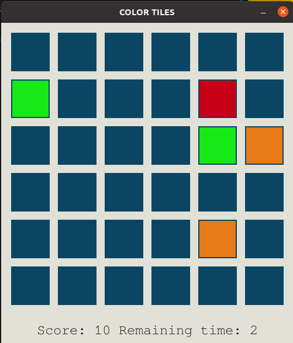

# Color Tiles - 2D memory game
This is a game developed using PyGame.
Basically, the player memorizes the hint and makes a move in a dedicated time.

## Dependencies/Pre-requisites
* python >= 3.7.7

* pip  _latest version is recommended_
    If pip is not installed, see https://pip.pypa.io/en/stable/installing/

* Pygame >= 2.0
    To install pygame using pip `python3 -m pip install -U pygame --user`

## Setup/Installation
1. Clone this repo. 
2. In the top level directory, run `python3 -m ./src/game`

## Usage
In top level directory, run:

`python3 -m ./src/game.py`

After executing this command, output will look like below.

